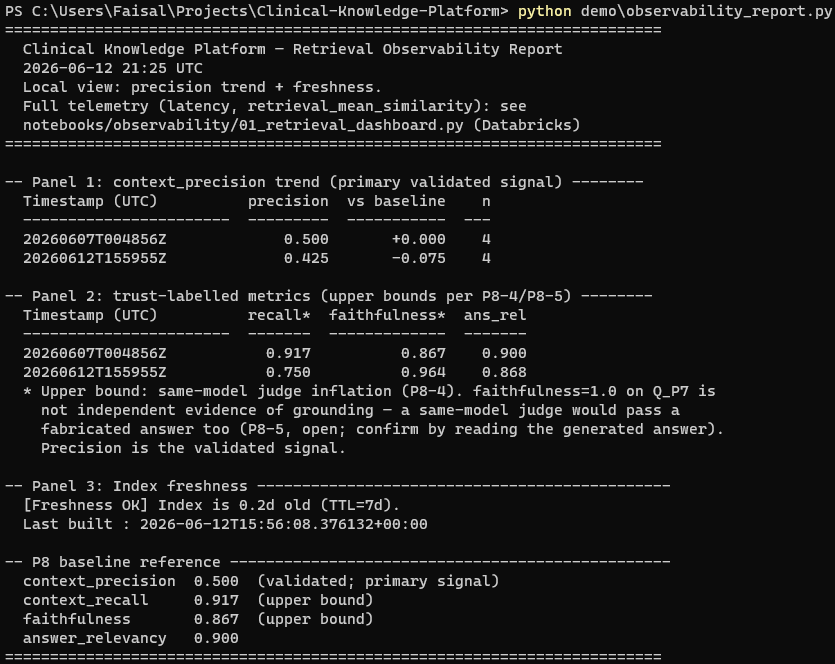

# Clinical Knowledge Platform

**A governed lakehouse with AI-serving and retrieval observability.**

NHS/NICE clinical guideline data ingested through a dbt-modelled medallion architecture on Azure/Databricks, orchestrated by Airflow with CI/CD via GitHub Actions, serving a RAG application with RAGAS evaluation and retrieval observability.

The AI layer is the *consumer* of the data platform: its correctness depends on the data engineering being solid. This project is built spine-first, the governed pipeline (P1–P6) before the AI layer (P7–P9), with a silent-degradation postmortem (P10) proving the monitoring catches quality decay, not just crashes.

> Portfolio project. Infrastructure identifiers are placeholdered; resources are disposable dev instances behind Azure AD.

---

## Why this project matters

This is a governed data platform built to demonstrate data engineering judgement, not just tool usage. It is not a RAG demo.

End to end on Azure and Databricks, it ingests, governs, validates, models, orchestrates, deploys, serves, evaluates, and monitors clinical guideline data, and documents the exact failure modes it catches. The three failure stories below are the point.

**Relevant for:** Azure Data Engineer, Databricks Data Engineer, Analytics Engineer, AI/RAG Data Engineer, regulated data platform roles, and healthcare or public-sector data teams.

---

## Architecture

```
SOURCES                  INGESTION               LAKEHOUSE (Databricks · Delta · Unity Catalog)
NHS/NICE guidelines  →   ADF Copy Activity    →  Bronze (raw, append-only, 6 provenance cols)
(HTML / PDF)             + Auto Loader            ↓ schema-contract gate + quarantine
corpus/raw/              (cloudFiles,             Silver (parsed text + metadata, deduped)
                          binaryFile format)       ↓ dbt (staging → marts)
                                                   Gold ├─ star schema (fct_guideline_document)
                                                        ├─ dim_guideline (SCD Type 2)
                                                        └─ RAG-ready chunks
                                                              ↓
AI SERVING:   chunk → embed (Azure OpenAI) → pgvector → LangChain retrieve → LLM → cited answer
RAGAS EVAL:   faithfulness · answer-relevancy · context-recall · context-precision (runs in DAG)
OBSERVABILITY: retrieval latency · mean similarity · eval-score trend · index freshness

ORCHESTRATION: Airflow DAG (ingest → bronze → silver → gold/dbt → embed → eval → publish)
CI/CD:         GitHub Actions (lint → pytest → dbt build → deploy → smoke test)
```

---

## Tech Stack

| Layer | Tool |
|---|---|
| Cloud | Azure (ADLS Gen2, ADF, Azure OpenAI) |
| Lakehouse | Databricks, Delta Lake, Unity Catalog |
| Transforms | dbt (incremental merge, 4 built-in + 2 custom data tests, lineage) |
| Orchestration | Apache Airflow (retries, backoff, SLAs, sensors) |
| Vector store | pgvector on Postgres (deliberate trade-off over Azure AI Search) |
| RAG | LangChain (thin glue layer) |
| Eval | RAGAS |
| CI/CD | GitHub Actions |
| IaC | Terraform |
| Testing & lint | pytest (unit tests on contract + scope gates) · ruff · black |

---

## The Three Flagship Failure Stories

The point of this platform is not that it works. It is that it **catches its own failures and proves it**. Three engineered failure modes, each with a documented mechanism, a detection signal, and a resolution.

### 1. Data-contract catch (P2)
Bad guideline data hits the Silver contract gate, gets quarantined with reason codes, blocks downstream, and **Silver does not update**. Two distinct reason codes (`MISSING_MANIFEST_ENTRY`, `INVALID_CLINICAL_AREA`) distinguish uncatalogued documents from out-of-scope ones.
→ `evidence/p2_contract_gate_proof.png`

### 2. CI/CD block (P6)
A bad PR fails the GitHub Actions gate (ruff + black + pytest); branch protection blocks the merge. Fixed commit, green, deploy proceeds. *(The gate did real work shipping the P9/P10 PR: three successive lint/format failures, each fixed and re-pushed, before the clean commit merged. A separate earlier attempt to push straight to `master` was refused outright by branch protection for the missing status check. The logged follow-up is a pre-commit hook running ruff and black locally, so the backstop stops being the first line of defence.)*
→ `evidence/p6_ci_gate_blocked.png`, `evidence/p6_cd_deploy.png`

### 3. Silent RAG degradation (P10) — the centrepiece
Embedding model drift induced on a targeted chunk subset (the production `text-embedding-3-small` chunks re-embedded with `text-embedding-ada-002`, same 1536 dims so cosine similarity computes silently). The system keeps running. Aggregate `context_precision` drops 0.500 → 0.425. **The freshness alert never fires**: re-embedding updates `embedded_at`, so the index reads *fresher than ever* while retrieval is broken. Only the eval gate catches it.



Full writeup: **[`docs/p10_postmortem.md`](docs/p10_postmortem.md)**. Three findings worth the read:

- **Freshness is structurally blind to model-version drift.** It answers "when was the index written?" not "which model wrote it?" Detecting this class needs a `model_version` column for the cause and a chunk_id stability check for the symptom; the eval signal alone is necessary but not sufficient.
- **Corpus redundancy is a blind spot in the eval signal too.** Q3a held precision 1.0 despite *0/5 chunk overlap*, because 4 of its 5 replacement chunks came from the same source documents (intra-document segment shuffling). `context_precision` measures topic relevance, not segment identity.
- **`faithfulness=1.0` was confirmed judge leniency.** The cited answer's clinical logic had no grounding in any retrieved chunk; a same-model judge passed its own plausible parametric output. *Faithfulness measures grounding-in-context, not truth.*

---

## Build Phases

DE spine (P1–P6) complete before AI layer (P7–P9). P10 is the postmortem. All phases complete.

| Phase | Goal | Proof artifact |
|---|---|---|
| P1 | ADF + Auto Loader → Bronze | `evidence/bronze_idempotency_proof_run_comparison.png` |
| P2 ⭐ | Silver + contract gate + quarantine | `evidence/p2_contract_gate_proof.png` |
| P3 | dbt models + tests (Silver → Gold) | `evidence/p3_dbt_lineage.png` |
| P4 | Dimensional model (star schema + SCD2) | `evidence/p4_scd2_transition.png` |
| P5 | Airflow DAG orchestration | `evidence/p5_dag_run_success.png` |
| P6 ⭐ | CI/CD via GitHub Actions | `evidence/p6_ci_gate_blocked.png` |
| P7 | RAG serving layer | `evidence/p7_qa_cited_answer.png` |
| P8 | RAGAS eval harness | `data/ragas_scores/` |
| P9 | Retrieval observability | `evidence/p9_observability_alert.png` |
| P10 ⭐ | Silent-degradation postmortem | `evidence/p10_3_degraded_report.png` + `docs/p10_postmortem.md` |

---

## Repository Layout

```
corpus/manifest/        Governance catalog (which guidelines are in scope)
adf/pipelines/          Azure Data Factory copy-activity definitions
notebooks/
  bronze/               Auto Loader ingestion (provenance columns)
  silver/               Contract gate + scope gate + quarantine
  gold/                 Silver → RAG chunks
  observability/        Databricks 4-panel retrieval dashboard
  admin/                Unity Catalog grants
dbt/
  models/staging/       stg_guidelines_parsed
  models/marts/         dim_guideline (SCD2), fct_guideline_document
  snapshots/ tests/     SCD2 snapshot + custom governance test
src/clinical_platform/
  contract.py scope.py  Data-contract + clinical-scope gates
  embed.py store.py     Embedding pipeline + pgvector (raw psycopg2)
  retriever.py qa.py    Retrieval + cited Q&A (LangChain confined here)
  eval.py telemetry.py  RAGAS harness + observability telemetry
demo/
  clinical_qa.py            End-to-end cited Q&A
  observability_report.py   Local 3-panel observability report
  p10_induce_degradation.py snapshot / induce / restore drift harness
terraform/              IaC for all Azure infra (toggled off by default)
docs/                   project_state.md · mistakes_and_fixes.md · p10_postmortem.md
evidence/               Proof screenshots per phase
```

---

## Quickstart (RAG layer)

The data spine runs on Azure/Databricks; the RAG layer runs locally against Docker pgvector.

```bash
# 1. Start pgvector (Docker)
docker-compose up -d

# 2. Install RAG-layer dependencies
pip install -r requirements-rag.txt

# 3. Configure environment
cp .env.example .env          # fill in Azure OpenAI + Databricks + pgvector vars

# 4. Embed Gold chunks into pgvector (first run)
python -m clinical_platform.embed

# 5. Run end-to-end cited Q&A
python demo/clinical_qa.py

# 6. View the observability report (precision trend + freshness)
python demo/observability_report.py
```

**Eval & postmortem:**
```bash
pip install -r requirements-eval.txt
python -m clinical_platform.eval                          # RAGAS baseline
python demo/p10_induce_degradation.py snapshot            # capture clean state
python demo/p10_induce_degradation.py induce --model ...  # induce drift
python demo/p10_induce_degradation.py restore             # recover (self-verifies the write)
```

**CI checks (run before pushing):**
```bash
ruff check .
black --check .
pytest
```

---

## Key Design Decisions

- **pgvector over Azure AI Search.** Relational integration and portability. A deliberate trade-off, evaluated and chosen, not a default.
- **HNSW over IVFFlat.** No minimum-corpus-size requirement; correct for a small clinical corpus.
- **`temperature=0` on GPT-4o.** Determinism for a clinical tool; reproducibility is a property, not an accident.
- **LangChain confined to `qa.py`.** `store.py` and `retriever.py` are raw psycopg2 + OpenAI SDK. The framework earns exactly one job.
- **Airflow triggers, does not execute.** It submits notebook runs to Databricks; no Spark runs locally.
- **CI is lint + pytest, no live Databricks.** Unit tests stay dependency-free; dbt runs in CD or locally.
- **Bronze provenance is non-negotiable.** Every row carries `source_url`, `retrieved_at`, `content_hash` (SHA-256), `guideline_version`, `pipeline_run_id`, `ingest_timestamp`.

---

## Corpus

10–15 NICE guidelines, **one clinical area** (type 2 diabetes). Coherence over breadth: a focused corpus makes retrieval failures legible and the eval signal meaningful. PDFs live in ADLS, not git; the governance manifest is tracked.
